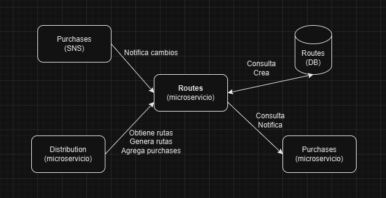

# Fravega Tech



Para la solución del proyecto utilicé estas herramientas:

- Arquitectura DDD
- Gin como router
- Zap for logging
- Inyección de dependencias
- Custom Middlewares
  - Logger inyectado en el contexto
  - Error handler
- Custom errors
- Validadores
- MockGen for testing

Generé tests para el archivo routes_srv.go ya que considero es el que mas lógica contiene.
Utilice test de tablas ya que considero es versatil y facilita de agregar nuevos casos.

## How to run

- go 1.23.8

Download dependencies with
`go mod tidy`

Then you can run
`go run main.go`

## Api documentation

La aplicación corre en el puerto 8080

En el root deje un .json con la colección de postman.

**-> Health Check**
 
`GET /ping`

Response:
```json
{
  "message": "pong"
}
```

-> Routes API (v1)

The following routes are under the path: `/api/v1/routes`

**-> Create Route**

`POST /api/v1/routes`

Request Body: 

```
{
  "vehicle": [string],
  "driver": [string]
}
```

Response:
```
{
  "id": "route-uuid",
  "vehicle": "vehicle_name",
  "driver": "driver_name",
  "purchases": [],
  "status": "pending"
}
```

**-> Get Route**

`GET /api/v1/routes/:route_id`

Path Params:
- route_id

Response:

200
```
{
  "id": "route-uuid",
  "vehicle": "vehicle_name",
  "driver": "driver_name",
  "purchases": [
    {
      "id": "purchase-uuid",
      "status": "pending"
    }
  ],
  "status": "pending"
}
```

404 - Route not found

**-> Add purchase to route**

Path Params:
- route_id 
- purchase_id

Response:

- 200 - Purchase successfully added
- 400 - Purchase is not in pending status
- 400 - Purchase already exist
- 404 - Purchase not exist

**-> Send notification purchase delivered**

`POST /api/v1/routes/:route_id/purchases/:purchase_id/notification`

Path Params:
- route_id 
- purchase_id

Response: 

- 200 - Notification send successfully
- 404 - Route not found
- 404 - Purchase not exist